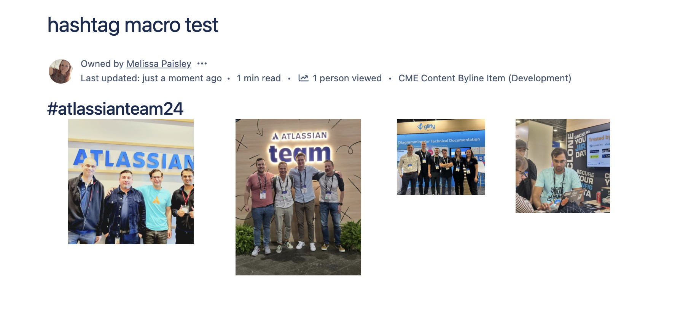

# Forge Hashtag Macro

This project contains a Forge app written in Javascript that displays instagram posts in a Confluence macro. 



See [developer.atlassian.com/platform/forge/](https://developer.atlassian.com/platform/forge) for documentation and tutorials explaining Forge.

## Requirements

See [Set up Forge](https://developer.atlassian.com/platform/forge/set-up-forge/) for instructions to get set up.

## Quick start

** IMPORTANT **

Before doing anything else, rename manifest-seereadme.yml to manifest.yml and run ```forge register``` to get your own unique Forge App ID. 

Then, you should create a Meta App at developers.facebook.com and replace the client id and config id in the manifest with those from your app. 

The configuration settings should be as follows:

- Login variation: Instagram Graph API
- Access token: User access token
- permissions: buisness_management, instagram_basic, pages_read_engagement, pages_show_list

In Facebook Login for Buisness settings, set: 
- The Redirect URI for Forge Apps is https://id.atlassian.com/outboundAuth/finish
- Web OAuth Login to Yes
- Embedded Browser OAuth Login set to Yes

Finally, don't forget to run ```forge deploy``` followed by ```forge providers configure``` to set you apps secret.  


- Modify your app frontend by editing the `src/frontend/index.jsx` file.

- Modify your app backend by editing the `src/resolvers/index.js` file to define resolver functions. See [Forge resolvers](https://developer.atlassian.com/platform/forge/runtime-reference/custom-ui-resolver/) for documentation on resolver functions.

- Build and deploy your app by running:
```
forge deploy
```

- Install your app in an Atlassian site by running:
```
forge install
```

- Develop your app by running `forge tunnel` to proxy invocations locally:
```
forge tunnel
```

### Notes
- Use the `forge deploy` command when you want to persist code changes.
- Use the `forge install` command when you want to install the app on a new site.
- Once the app is installed on a site, the site picks up the new app changes you deploy without needing to rerun the install command.

